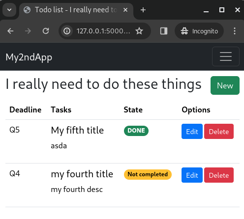

# # My app




## TBD Features

[DONE] Deadline field

- [ ] Implement Markdown
- [ ] Migrate from function "load_logged_user" to use "current_user" from flask library
- [ ] Containerize using Podman

## Directory structure

```
├── main.py
├── requirements.txt
└── website
    ├── auth.py
    ├── __init__.py
    ├── models.py
    ├── templates
    │   ├── base.html
    │   └── index.html
    └── views.py
```

Reference:

1. [Crea una lista de tareas con Flask y Python utilizando Bootstrap 5: Tutorial paso a paso - YouTube](https://www.youtube.com/watch?v=BetOsz7aCbU)
2. [How To Use Python-Markdown with Flask and SQLite | DigitalOcean](https://www.digitalocean.com/community/tutorials/how-to-use-python-markdown-with-flask-and-sqlite)
3. [Bootstrap 5.3]([Get started with Bootstrap · Bootstrap v5.3](https://getbootstrap.com/docs/5.3/getting-started/introduction/))
